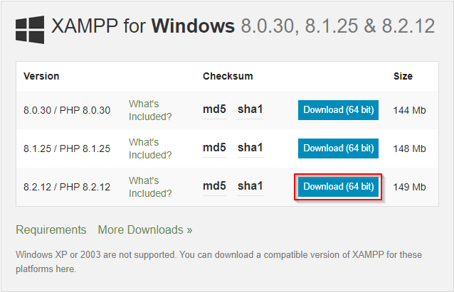
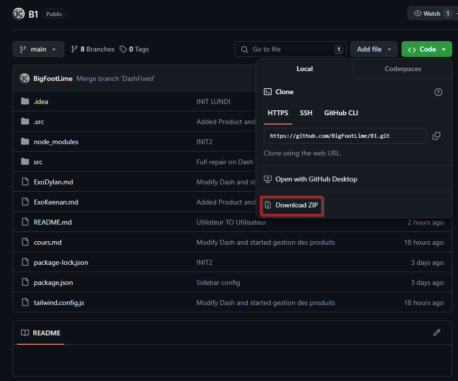
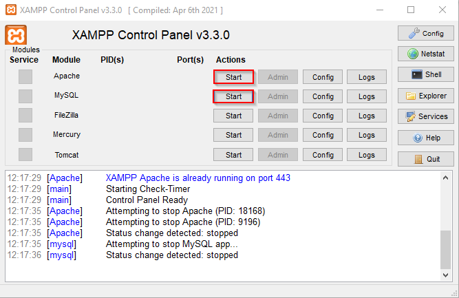
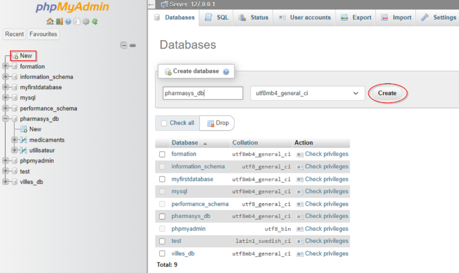

# The Context 

## PharmaSys, Pharmaceutical Stock Manager

* PharmaSys is an innovative and intuitive pharmaceutical stock management application
developed with care by Keenan and Dylan. 
This solution is specifically designed to optimize the management of pharmaceutical warehouse,
ensuring smooth and efficient stock management.

* PharmaSys positions itself as an indispensable ally for pharmaceutical warehouse,
offering optimized stock management that ensures not only the availability of products 
but also their safety and compliance. Developed by Keenan and Dylan, 
PharmaSys combines innovation and practicality to transform pharmaceutical stock management
into a simple and effective task.

* Currently based in Luxembourg, PharmaSys is a leading provider for pharmaceutical
warehouse in France. They supply every pharmacy within a 200 km radius,
ensuring all stock is managed efficiently and effectively.

* For more detail about the application, it can manage the stock of the warehouse and also 
take orders from pharmacy's that need supply.

# Setting up

## required element 

### XAMPP

XAMPP makes it easy to set up a development environment and a MySQL or MariaDB database.

First you will need to download XAMPP here : https://www.apachefriends.org/download.html

Then, download this version :\

After the download finish you can lunch the installation and follow evey step without
change any setting 

## Our Project

Now you will need to access our code to be able to do the management. 

So you will need to go on GitHub and download it 

Here the link to the deposit : https://github.com/BigFootLime/B1

And download it here :\

Now you will need to extract the ZIP (with Winrar or 7zip (or anything else)) in the good 
location :\
**C:\xampp\htdocs**\

## Setting Up of the DataBase

First of all you will need to start XAMPP service 

Like this :\

Then you will need to go on phpMyAdmin 
There is the link : http://localhost/phpmyadmin/index.php 

Now you will need to creat a DB (DataBase) like this :\

We export our DataBase in our B1 folder and you can find it right here : 

